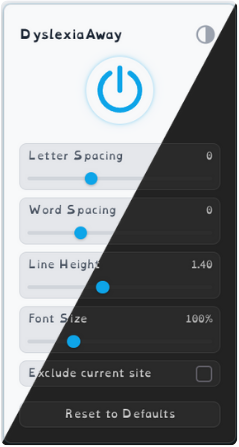

# DyslexiaAway

A small browser extension that applies the **OpenDyslexic** font to webpages.
For some of us, that small change makes reading a lot easier. ✨

---

## Features

* **Instant Toggle:** Turn it on or off with one click
* **Theme Switching:** Choose between light, dark, or system themes
* **Custom Settings:** Adjust spacing, line height, and font size
* **Site Exclusion:** Skip pages where it could cause issues

## Sample

## Installation (Chromium Browsers)

1. **Download:** Get the latest `dyslexia-away-*.zip` from the [Releases page](https://github.com/ernvk23/dyslexia-away/releases)
2. **Install:** Go to `chrome://extensions` and drag & drop the ZIP file onto the page
3. **Confirm:** Click "Add extension" when prompted

You'll see the icon in your toolbar. Click it to toggle or adjust the settings.

> **Alternative:** If drag & drop doesn't work, extract the ZIP file and use "Load unpacked" in Developer mode.

## Motivation

I built this because I wanted something simple that just makes reading feel better.
A lot of accessibility tools are great but try to do too much.
This one only does one thing - and that's enough for me.

If reading has ever felt harder than it should be, this might help.
For me, it made things click in a way they hadn't before.

> [!TIP]
> *Sometimes it's not you - it's just the font*

## License

Licensed under the [MIT License](./LICENSE).

## Font Credits

[OpenDyslexic](https://opendyslexic.org/) - an open typeface made to help with reading.